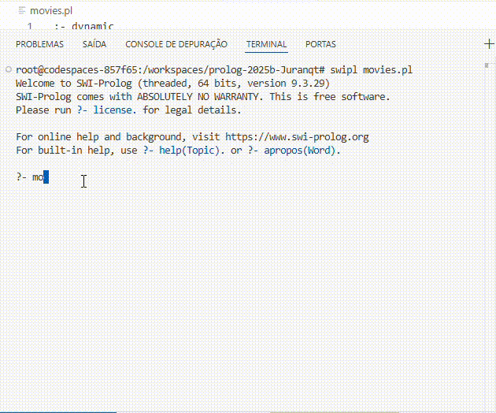
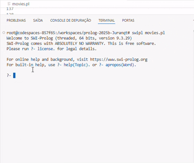
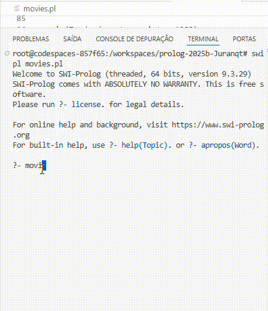
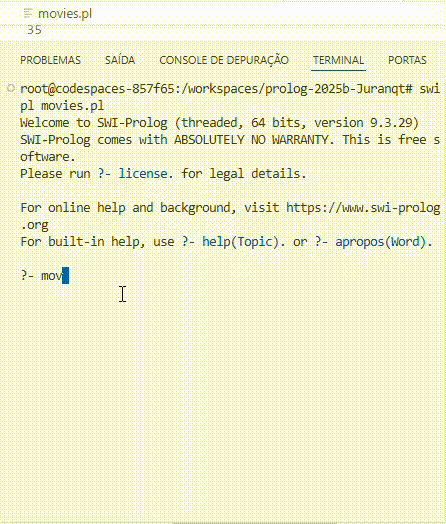
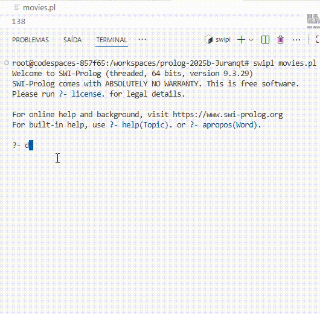
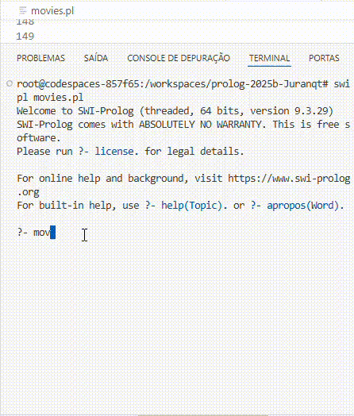
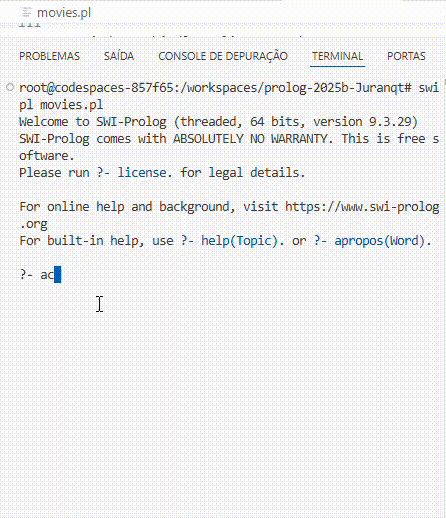
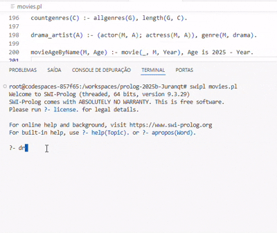

# Programação Lógica – Prolog

## 📚 Parte Teórica

### ✅ Pontos compreendidos

**Unificação**  
Processo que verifica se dois termos podem ser tornados idênticos, atribuindo valores a variáveis quando necessário.  
- É fundamental para a execução dos programas em Prolog.  
- Pode ser feita explicitamente com o operador `=`.  

Exemplo:  
```prolog
?- A = 1.
A = 1.

?- casa(_, azul, _) = casa(bob, _, gato).
true.
```

---

**Variável anônima (`_`)**  
- Usada como *placeholder*, quando o valor em si não importa, apenas a posição.  
- Evita criar variáveis que não serão utilizadas.  

Exemplo:  
```prolog
?- casa(_, azul, _) = casa(bob, azul, gato).
true.
```

---

**Predicado `nextto/3`**  
- Usado para verificar se dois elementos são consecutivos em uma lista.  

Exemplo:  
```prolog
?- nextto(b,c,[a,b,c,d]).
true.

?- nextto(b,X,[a,b,1,a,b,2]).
X = 1 ;
X = 2 ;
false.
```

---

### ❌ Pontos não compreendidos

**Predicado `findall/3`**  
Inicialmente confuso, mas o entendimento melhorou com este exemplo:  

```prolog
happening(monday,chemistry).
happening(monday,english).
happening(tuesday,chemistry).
happening(wednesday,maths).
happening(friday,chemistry).
happening(friday,maths).

find_lessons(Bag) :- findall(X, happening(X,chemistry), Bag).
```

Consulta:  
```prolog
?- find_lessons(Bag).
Bag = [monday, tuesday, friday].
```

Aqui, `findall/3` coleta todos os valores possíveis de `X` que satisfazem a condição `happening(X, chemistry)` e retorna a lista completa em `Bag`.  

---

**Uso de `trace`**  
- O modo de depuração mostra muitos passos (Call, Exit, Redo, Fail), mas não é trivial interpretar.  

Exemplo de saída:  
```prolog
?- trace, member(X,[a,b]).
   Call: (10) member(_G123,[a,b]) ?
   Exit: (10) member(a,[a,b]) ?
X = a ;
   Redo: (10) member(_G123,[a,b]) ?
   Exit: (10) member(b,[a,b]) ?
X = b.
```

- A dificuldade é entender exatamente o que significa cada etapa (`Call`, `Exit`, `Redo`, `Fail`).  

---

**Predicados dinâmicos (`assert` / `retract`)**  
- Ainda é difícil compreender como atualizar a base de conhecimento em tempo de execução.  

Exemplo:  
```prolog
?- assert(fato(novo)).
true.

?- fato(novo).
true.

?- retract(fato(novo)).
true.

?- fato(novo).
false.
```

- Dúvida: quando faz sentido usar isso em vez de trabalhar só com fatos fixos no arquivo `.pl`.  

---

## 🛠️ Parte Prática

### Exercícios realizados com `movies.pl`
1. **O filme schindlers_list é uma comédia?**



2. **Quais os atores (masculinos) do filme inglorious_basterds?**



3. **Quais os filmes lançados na década de 80 (entre 1981 e 1990, inclusive)? Dica: veja operadores relacionais no material da aula passada.**

 

4. **Quais os atores ou atrizes do filme the_hunger_games?**
 -  Nesse fiz uma consulta prévia apenas para não ficar repetindo o número do filme.

 

6. **O ator brad_pitt é um ator de drama?**

 

6. **Há quantos anos foi lançado o filme big_fish? Consulte o material da aula passada para saber como fazer operações aritméticas em Prolog.**

 

7. **O ator liam_neeson é um ator de comédia?**

 
 

---

### Regras adicionadas no arquivo `movies.pl`

- `drama_artist(A)` → verdadeiro se `A` for ator ou atriz de um filme de drama.  
- `movieAgeByName(M, Age)` → retorna a idade do filme `M` em anos, calculada a partir do ano atual.  



---

### Consultas com listas

**Gêneros de filmes da base:**  
```prolog
?- allgenres(G).
G = [drama, comedy, thriller, ...].
```

**Primeiro gênero da lista:**  
```prolog
?- allgenres(G), G = [H | _].
H = drama.
```

**Quantidade de gêneros distintos:**  
```prolog
?- countgenres(C).
C = 27.
```


---

## 📖 Referências Bibliográficas

- Stack Overflow – *How do I write findall in a Prolog code itself?*  
- [SWI-Prolog Documentation](https://www.swi-prolog.org/pldoc/)  
- Robert Sebesta. *Conceitos de Linguagens de Programação*. Bookman, 2018.  
- Patrick Blackburn, Johan Bos, Kristina Striegnitz. *Learn Prolog Now*.  
- Markus Triska. *The Power of Prolog*.  
